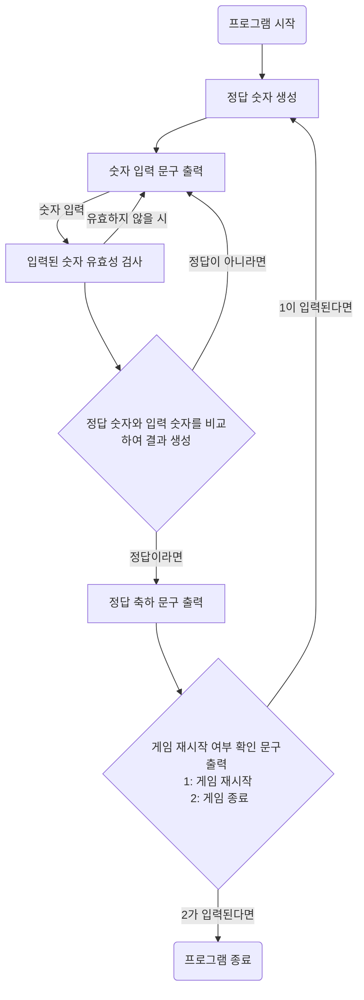

# 프로그램 수행 흐름

# 기능 설계

### constants
- [X] BaseballGame: 숫자 야구 게임 관련 상수들을 정의한 클래스
- MIN_DIGIT = 0
- MAX_DIGIT = 9
- BASEBALL_NUMBER_LENGTH = 3
### domain
- [X] Digit: 0-9까지 숫자만을 갖는 숫자 객체
- valid(): 해당 숫자가 0-9 사이인지 검사하는 메서드
- [ ] BaseballNumber: Digit를 세 개 가진 숫자 야구 값 객체
- compareTo(BaseballNumber): 사용자가 입력한 숫자 야구와 정답 숫자 야구를 비교하는 메서드
- match(int number, int position): number와 position로 결과인 BaseballResult를 반환하는 메서드
    - matchNumber(number): 동일한 number가 있는지 판별하는 메서드
    - matchPosition(position, numberPosition): numberPosition과 position이 동일한지 판별하는 메서드
- [X] BaseballResultType: 숫자 야구 결과값 종류를 나타내는 ENUM
- 이름, number, position
- nothing: false, false
- ball: true, false
- strike: true, true
- [X] BaseballResult: 숫자 야구 결과를 나타내는 객체
- EnumMap에 결과 타입의 개수를 저장한다.
### service
- [ ] BaseballGameService: 숫자 야구 게임을 실행할 수 있는 메서드를 가진 인터페이스
- [ ] BaseBallGameServiceImpl: 숫자 야구 게임을 실행할 수 있는 메서드를 가진 클래스
- createAnswer(): 정답 숫자를 생성하는 메서드
- getResult(answer, guess): 정답 숫자와 입력된 숫자를 비교하여 결과를 반환하는 클래스

### View
- [ ] BaseballGameView: 숫자 야구 게임과 관련한 뷰를 가진 클래스
- getBaseballNumber(): 숫자 입력 문구를 출력하고 사용자에게 숫자를 입력 받는 뷰
- printResult(BaseballResult): BaseballResult에 따라 결과를 출력하는 뷰
    - printCorrectAnswer(): 정답일 시 정답 문구를 출력
        - willRestart(): 게임 재시작 여부 문구를 출력하고 재시작 여부를 반환하는 뷰
    - printIncorrectAnswer(): 정답이 아닐 시 결과를 출력
### controller
- [ ] BaseballGameController: 숫자 야구 게임을 시작할 수 있는 클래스
    - run(): 숫자 야구 게임을 시작하는 메서드

